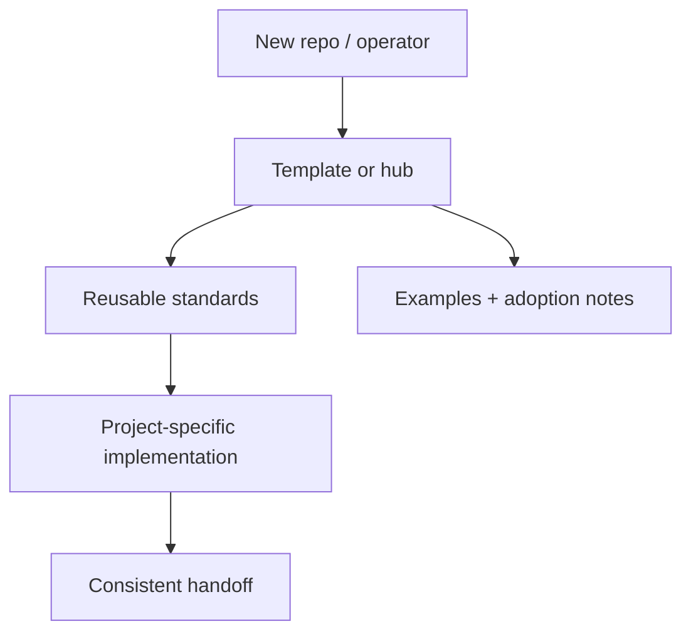

# SDK Ts

   

Roasted with [https://github.com/hidai25/readme-roast](https://github.com/hidai25/readme-roast) on 2026-06-25. This block is evidence-only: repo metadata, root files, and the existing README were scanned before writing.

Built by **Steven Seagondollar** using **DropShock Digital** documentation and product patterns.

---

## First screen

| Area | Detail |
| --- | --- |
| Repository | [`seagpt/sdk-ts`](https://github.com/seagpt/sdk-ts) |
| Primary class | profile / organization hub |
| Current posture | prototype |
| Default branch | `main` |
| Visibility | public |
| Last README standardization | 2026-06-26 |

## What matters

- Make the repo purpose obvious in the first 30 seconds.
- Put the architecture or workflow in a visual map before deep prose.
- Keep commands, environment notes, and handoff risks close to the top.
- Credit the real builder/maintainer while keeping client or project context separate from implementation notes.
- Audit priority: `P1`

## System map



## Best features carried forward

- Visual-first GitHub Markdown is kept, but constrained to one clear hero/asset lane.
- Existing Mermaid thinking is preserved and moved near the top as the system map.
- Existing setup intent is kept and reframed as a short operator path.

## Operate this repo

**Detected stack:** Node/Bun package metadata

```bash
bun install
bun run dev
```

> Commands above are inferred from repository files and should be verified before they become release or client handoff instructions.


### Detected package scripts

| Script | Command |
| --- | --- |
| `test` | `./scripts/test` |
| `build` | `./scripts/build` |
| `prepublishOnly` | `echo 'to publish, run yarn build && (cd dist; yarn publish)' && exit 1` |
| `format` | `./scripts/format` |
| `prepare` | `if ./scripts/utils/check-is-in-git-install.sh; then ./scripts/build && ./scripts/utils/git-swap.sh; fi` |
| `tsn` | `ts-node -r tsconfig-paths/register` |
| `lint` | `./scripts/lint` |
| `fix` | `./scripts/format` |

## Documentation map

- [`CHANGELOG.md`](CHANGELOG.md)
- [`CONTRIBUTING.md`](CONTRIBUTING.md)
- [`LICENSE`](LICENSE)
- [`SECURITY.md`](SECURITY.md)

## Handoff notes

| Area | Detail |
| --- | --- |
| Secrets | No `.env.example` was detected; add one before documenting environment-specific setup. |
| License | License file detected. |
| Owner credit | Built by Steven Seagondollar using DropShock Digital documentation and product patterns. |
| Next documentation move | Add `docs/ARCHITECTURE.md` with the full system diagram and decisions. |

## Maintenance standard

This README follows the DropShock repo documentation format: one clear identity, one visual map, a short operator path, explicit ownership, and deeper detail moved into linked docs when needed. If the repo grows, add or update `docs/ARCHITECTURE.md`, `docs/DEPLOYMENT.md`, and `docs/OPERATIONS.md` instead of turning the README into a wall of text.
